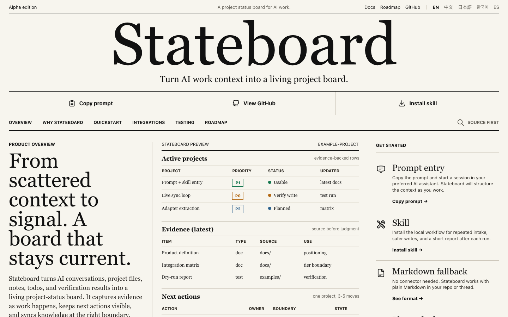

# Stateboard

[中文](README.zh.md)

[GitHub Page](https://kongzhen.github.io/stateboard/) ·
[中文](https://kongzhen.github.io/stateboard/index.zh.html) ·
[日本語](https://kongzhen.github.io/stateboard/index.ja.html) ·
[한국어](https://kongzhen.github.io/stateboard/index.ko.html) ·
[Español](https://kongzhen.github.io/stateboard/index.es.html)



Turn AI work context into a living project board.

Stateboard turns scattered work context from AI conversations, project files, project notes, todos, and verification results into a maintained project-status board. It can then sync that board into the todo, calendar, documentation, or collaboration tools people already use.

> Status: alpha. V1 ships two entry points: a copyable prompt and an installable Codex skill. Core packages and adapters will be extracted from verified real-world sync flows.

## What It Solves

Work often happens across Codex, ChatGPT, Claude, DeepSeek, WorkBuddy, local repositories, Notion, calendars, and todo apps. A normal todo tool can store "what to do", but it cannot reliably infer:

- which projects are actually active
- which items are only historical context
- what evidence supports the current state
- whether the next step is implementation, verification, decision-making, release, or waiting on input
- how priority should change
- whether to update an existing destination task or create a new one

Stateboard is not a chat-to-todo splitter. It maintains a project-state layer.

```text
AI conversations / project files / project notes
-> evidence-based project state
-> durable project tasks
-> todo, calendar, docs, or team tools
-> optional scheduled refresh
```

## Two Entry Points

### 1. Prompt: zero-install quickstart

Copy [prompts/stateboard-sync-prompt.md](prompts/stateboard-sync-prompt.md) and fill in four fields once:

- What to organize
- Destination
- Target location
- Automatic refresh

Use this when you want to:

- test whether Stateboard fits your workflow
- run manually in Codex, ChatGPT, Claude, DeepSeek, WorkBuddy, or another AI environment
- produce a Markdown fallback when no connector or skill is available

### 2. Skill: reproducible workflow

Install [skills/stateboard-codex](skills/stateboard-codex/):

```bash
cp -R skills/stateboard-codex ~/.codex/skills/stateboard-codex
```

Use it in Codex:

```text
$stateboard-codex

What to organize: the current project
Destination: Markdown only
Target location: reply directly in this thread
Automatic refresh: not needed
```

Use this when you want:

- repeatable project-state rules
- reuse across sessions
- stronger guardrails
- future sync into real task systems and scheduled refresh

## Runtime Language

Prompt and skill output should follow the user's request language by default:

- English request -> English project tasks and run report.
- Chinese request -> Chinese project tasks and run report.
- Mixed request -> follow the user's explicit language preference; if unclear, ask once before writing to an external destination.
- Bilingual output is only produced when the user asks for it.

## Current Integration Strategy

Stateboard separates "directly writable in the current environment" from "possible through an official API after configuration". Do not collapse these into a vague claim of platform support.

| Destination | Current recommendation |
|---|---|
| 滴答清单 / Dida / TickTick | Good first real task-board target when the MCP connector is available |
| Google Calendar | Useful for project review blocks, not as the task database |
| Notion | Good for a project dashboard or documentation surface |
| 飞书 / Lark | Best candidate for an enterprise task-system adapter |
| 钉钉 / DingTalk | Useful for enterprise work todos, but depends on org apps and permissions |
| 企业微信 / WeCom | Prefer as notification and calendar layer, not the only task database |
| Other tools | Start with Markdown, CSV-like rows, or copy/import instructions |

See [docs/integration-matrix.md](docs/integration-matrix.md) for the current capability matrix.

## Guardrails

- Establish the truth layer before judging project state and priority.
- Default to one durable project task per real project, with 3-5 next actions.
- Search before writing; update the same destination task when possible.
- Do not fragment historical memory into many low-value tasks.
- Do not create recurring automation without a confirmed frequency and exact time.
- Do not describe webhook notifications as a complete task system.
- Do not write tokens, webhook secrets, license keys, credentials, or private destination identifiers into public docs or task bodies.

## Repository Layout

```text
prompts/
  stateboard-sync-prompt.md
  stateboard-sync-prompt.zh.md
  stateboard-automation-prompt.md
  stateboard-automation-prompt.zh.md

skills/stateboard-codex/
  SKILL.md
  SKILL.zh.md
  README.md
  README.zh.md
  references/
  templates/
  examples/

docs/
  product-definition.md
  product-definition.zh.md
  integration-matrix.md
  integration-matrix.zh.md
  testing.md
  testing.zh.md
  index.html
  index.zh.html

packages/
  core/
  adapters/
```

## Local Verification

Minimum dry-run:

```text
What to organize: the current project
Destination: Markdown only
Target location: reply directly in this thread
Automatic refresh: not needed
```

For a real write test, use a separate test list or page and verify:

- only one project-status task is created or updated
- search can retrieve the same task
- a second run updates the same task instead of duplicating it
- the run report states what was created, updated, skipped, verified, and still blocked

## Documentation

- [Product definition](docs/product-definition.md)
- [Prompt entry](docs/prompt-template.md)
- [Testing](docs/testing.md)
- [Integration matrix](docs/integration-matrix.md)
- [Roadmap](docs/roadmap.md)

## Roadmap

- Phase 1: validate the prompt and `stateboard-codex` skill entry points
- Phase 2: extract `ProjectState`, `TaskSink`, `CalendarSink`, and `NotificationSink`
- Phase 3: implement Dida/TickTick, Notion, Google Calendar, and Feishu/Lark adapters
- Phase 4: add CLI, examples, and more verified destination systems

## License

MIT. See [LICENSE](LICENSE).
